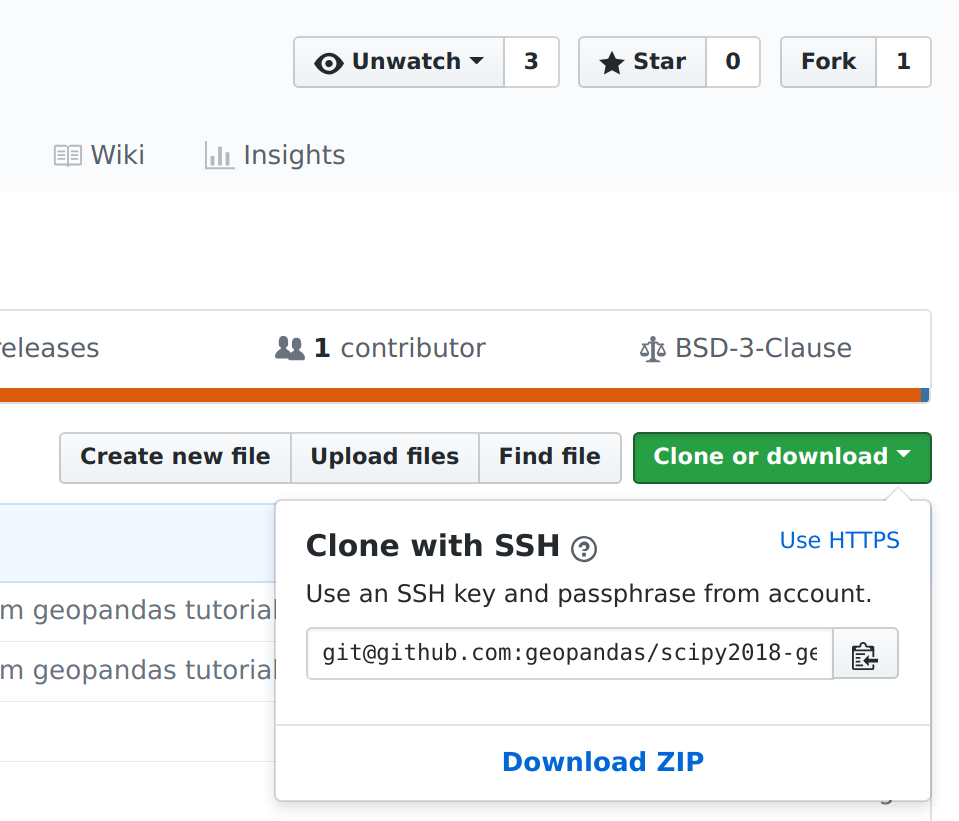

# Scipy 2018 Tutorial - Introduction to Geospatial Data Analysis with Python 

[](https://mybinder.org/v2/gh/geopandas/scipy2018-geospatial-data/master)

### Instructors

- [Levi John Wolf](https://ljwolf.org) - [University of Bristol](http://www.bristol.ac.uk/geography/levi-j-wolf/overview.html)
- Sergio Rey - [Center for Geospatial Sciences, University of California, Riverside](http://spatial.ucr.edu/peopleRey.html)
- [Dani Arribas-Bel](http://darribas.org/) -  University of Liverpool
- [Joris Van den Bossche](https://jorisvandenbossche.github.io/) - Université Paris-Saclay Center for Data Science 

This tutorial is an introduction to geospatial data analysis in Python, with a focus on tabular vector data. It first focuses on introducing the participants to the different libraries to work with geospatial data and will cover munging geo-data and exploring relations over space. This includes importing data in different formats (e.g. shapefile, GeoJSON), visualizing, combining and tidying them up for analysis, and will use libraries such as `pandas`, `geopandas`, `shapely`, `PySAL`, or `rasterio`. The second part will build upon this and focus on more more advanced geographic data science and statistical methods to gain insight from the data. No previous experience with those geospatial python libraries is needed, but basic familiarity with geospatial data and concepts (shapefiles, vector vs raster data) and pandas will be helpful.

## Outline of the Workshop

- 7:50 - 8:20: **Installation & setup**

  If you cannot complete the installation instructions ahead of time, please come slightly early so we can work on ensuring everyone can get the required packages installed and so that you can run the workshop material & exercises

- 8:20 - 9:00: **Working with spatial data**

  <!-- synthesize `01,04,05` -->

- 9:00-10:00: **Spatial Relationships & Joins**

  <!-- synthesize `02,03`, plus a very small bit of `99` -->

- 10:00 - 10:10: **Break**

- 10:10 - 11:00: **Exploratory spatial data analysis**

  <!-- notebook `03,08` for profiles of clusters -->

- 11:00 - 12:00: **Leveraging space in modeling**

  <!-- notebook `07`, basic feature engineering, kernel regression, & endog regression -->

## Installation notes

Following this tutorial will require recent installations of:

- Python >= 3.5 (it will probably work on python 2.7 as well, but I didn't test it specifically)
- pandas
- geopandas >= 0.3.0
- matplotlib
- rtree
- PySAL
- scikit-learn
- mgwr
- cartopy
- geoplot
- [Jupyter Notebook](http://jupyter.org)

If you do not yet have these packages installed, we recommend to use the [conda](http://conda.pydata.org/docs/intro.html) package manager to install all the requirements 
(you can install [miniconda](http://conda.pydata.org/miniconda.html) or install the (larger) Anaconda
distribution, found at https://www.anaconda.com/download/).

Once this is installed, the following command will install all required packages in your Python environment:

```
conda env create -f environment.yml
```

But of course, using another distribution (e.g. Enthought Canopy) or ``pip`` is fine as well (a requirements file is provided as well), as long as you have the above packages installed.


## Downloading the tutorial materials

**NOTE:** *We may update the materials up until the workshop. So, please make sure that, if you download the materials, you refresh the downloaded material close to the workshop.*

If you have git installed, you can get the tutorial materials by cloning this repo:

    git clone https://github.com/geopandas/scipy2018-geospatial-data

Otherwise, you can download the repository as a .zip file by heading over
to the GitHub repository (https://github.com/geopandas/scipy2018-geospatial-data) in
your browser and click the green "Download" button in the upper right:




## Test the tutorial environment

To make sure everything was installed correctly, open a terminal, and change its directory (`cd`) so that your working directory is the tutorial materials you downloaded in the step above. Then enter the following:

```sh
python check_environment.py
```

Make sure that this scripts prints "All good. Enjoy the tutorial!"

